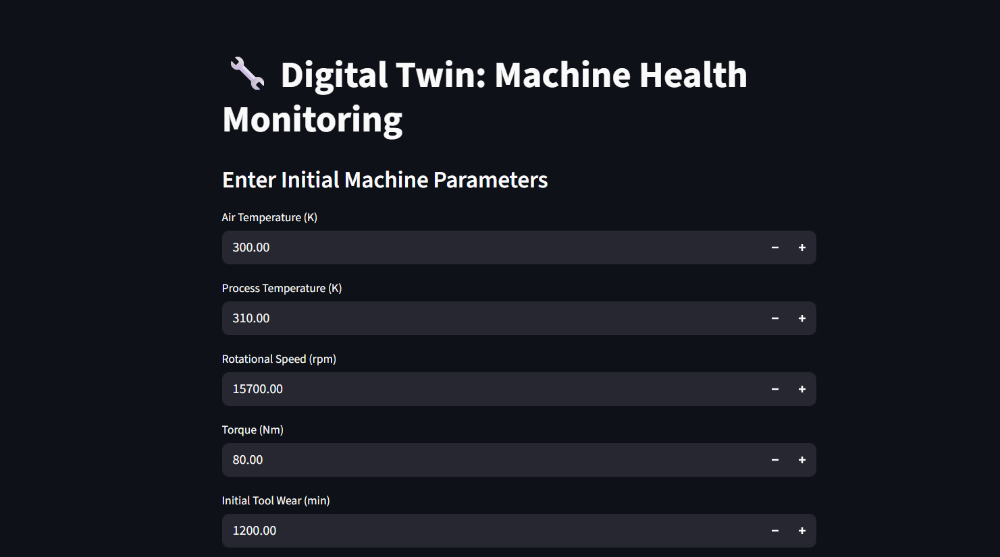
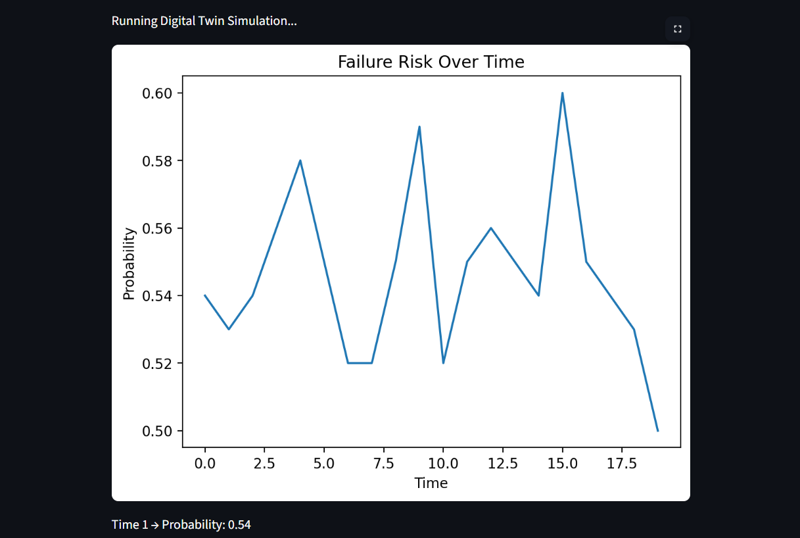
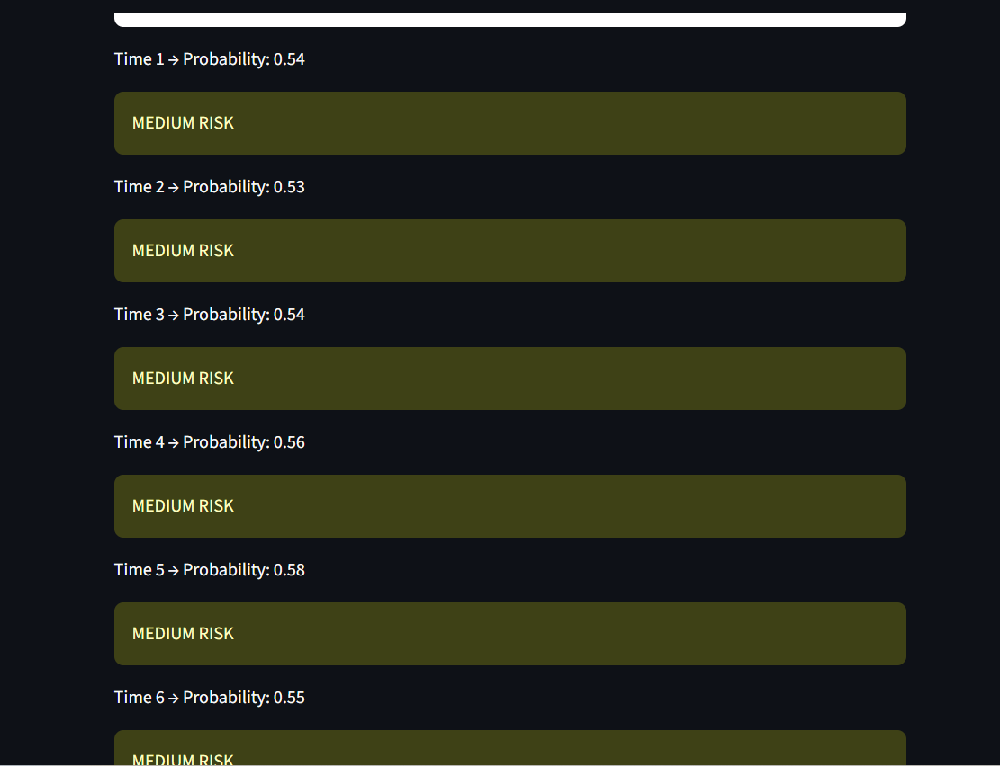
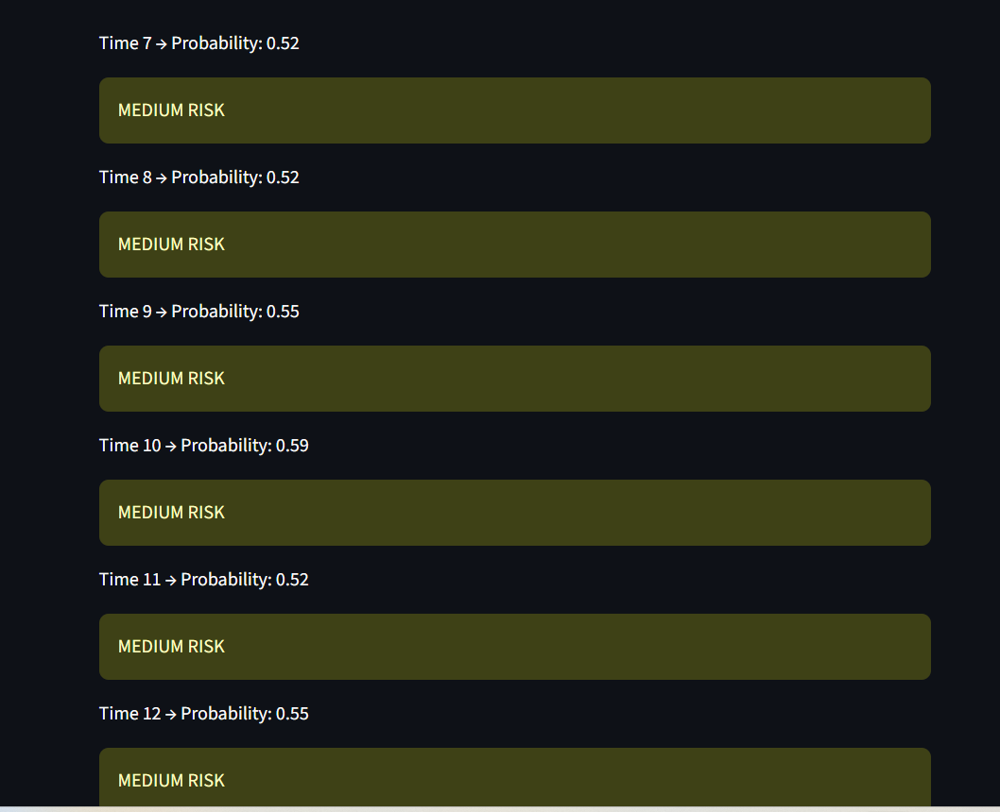
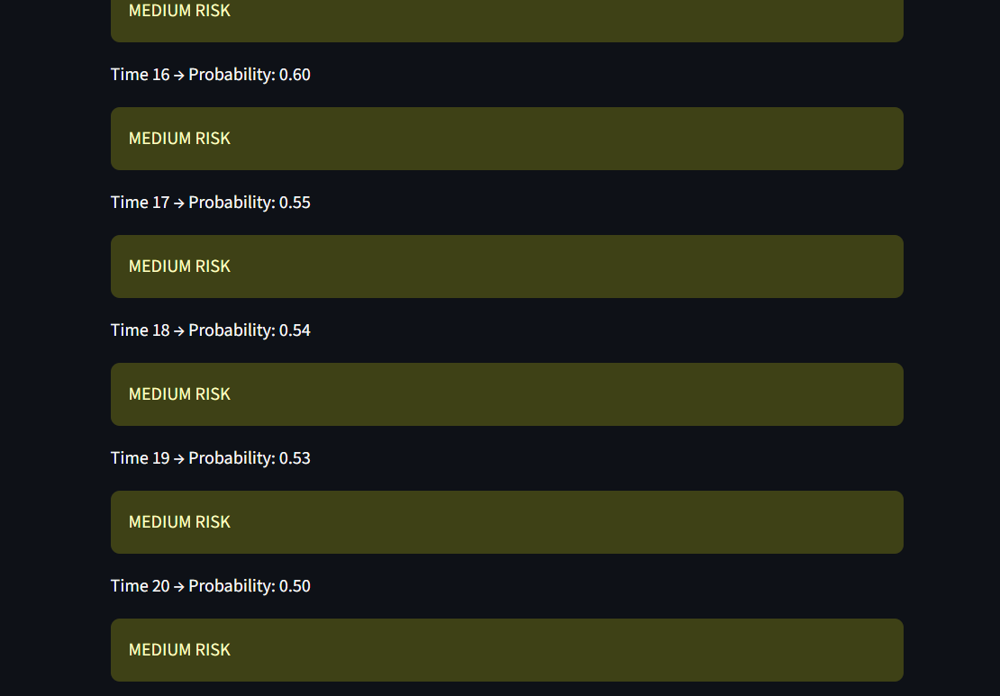

# Digital Twin for Predictive Maintenance

## Project Overview

This project implements a digital twin model for monitoring machine health and predicting potential failures using machine learning techniques. The system uses operational parameters such as air temperature, process temperature, rotational speed, torque, and tool wear to estimate failure probability.


## Features

* Predicts machine failure using a trained machine learning model
* Classifies risk levels into Low, Medium, and High
* Interactive user interface built with Streamlit
* Supports real-time input and simulation


## Tech Stack

* Python
* Scikit-learn
* Streamlit
* Pandas
* Matplotlib


## Dataset

The model is trained on the AI4I 2020 Predictive Maintenance dataset.


## How to Run

Install dependencies:

```bash
pip install -r requirements.txt
```

Run the application:

```bash
streamlit run app.py
```
## Live Demo
https://machine-health-digital-twin.streamlit.app/

## Results

The system outputs:

* Failure prediction (Safe / Failure Likely)
* Probability of failure
* Risk level classification


## Output Screenshots

### User Interface


### Failure Risk Graph



### Results






## Future Work

* Integration with real-time sensor data
* Advanced visualization dashboard
* Cloud deployment for remote monitoring


## Author

Divyansh Pratap Singh
